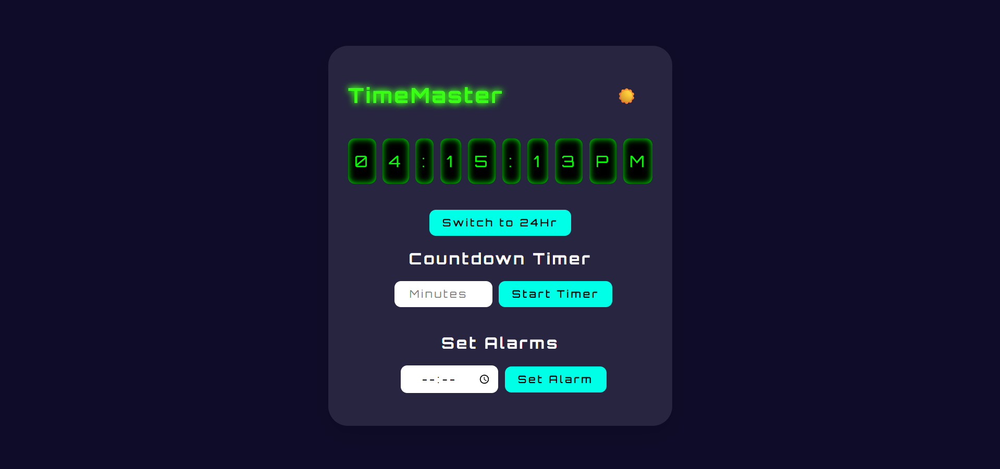
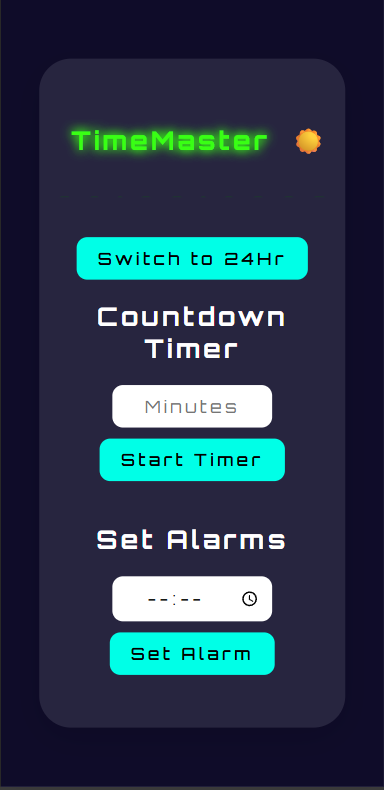

# 🕒 Digital Clock + Countdown Timer + Alarm

A fully responsive and feature-rich Digital Clock App built using **HTML**, **CSS**, and **JavaScript**.

---

## 📸 Preview





---

## 🔥 Features

- ✅ Real-time Flip-Style Digital Clock (12hr/24hr toggle)
- ⏱️ Countdown Timer with auto-restore on reload
- ⏰ Alarm System with multiple alarms
- 🛑 Stop Alarm button (alarm rings until stopped)
- 🌙 Dark/Light Mode Toggle (persistent with localStorage)
- 💾 All data saved in LocalStorage (theme, alarms, timer)
- 📱 Fully responsive + neon/glassmorphism style

---

## 🧰 Tech Stack

- HTML5
- CSS3 (Neon & Flip Clock Styling)
- Vanilla JavaScript (DOM, Events, setInterval, localStorage)

---

## 🚀 Live Demo

👉 [Click here to try it out](https://devforgeindia.github.io/digital-clock-timer/)
👉 [Watch the YouTube Tutorial](https://youtu.be/Cxq5CphMN8I)

---

## 🚀 Getting Started

### 1. Clone the Repository

```bash
git clone https://github.com/DevForgeIndia/digital-clock-timer.git
cd digital-clock-timer
```

### 2. Open in Browser

Just open `index.html` in your browser. No build tools or setup required.

---

## 📁 Project Structure

```
/digital-clock-timer
├── index.html
├── style.css
└── script.js
```

---

## 🎯 Learnings

- Mastered `setInterval`, `Date` functions, and `localStorage`
- Built complex event-based UI interactions
- Designed responsive, theme-adaptive UIs

---

## 🙌 Contributing

Feel free to fork the repo and submit pull requests. Suggestions welcome!

---

## 🙌 Support

If you like this project, consider ⭐ starring the repo and subscribing on YouTube!

---

Made with ❤️ by [DevForge India](https://www.youtube.com/@DevForge-India)
